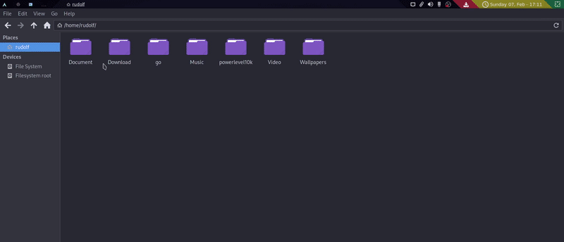

## Organizer

### Description

Organizer is a Python script for organize the Download directory in Audio, Image, Video and Other, depending of the file extension.
<hr>

### How to use

Clone the repository and run the script with python
```bash
// Inside the directory
python organizer.py
```
You can also pass a directory as command using relative path if you want specify the folder to organize.

[](./example.gif)

Note: The script require the ```home/user/Downloads``` directory when no command is passed.